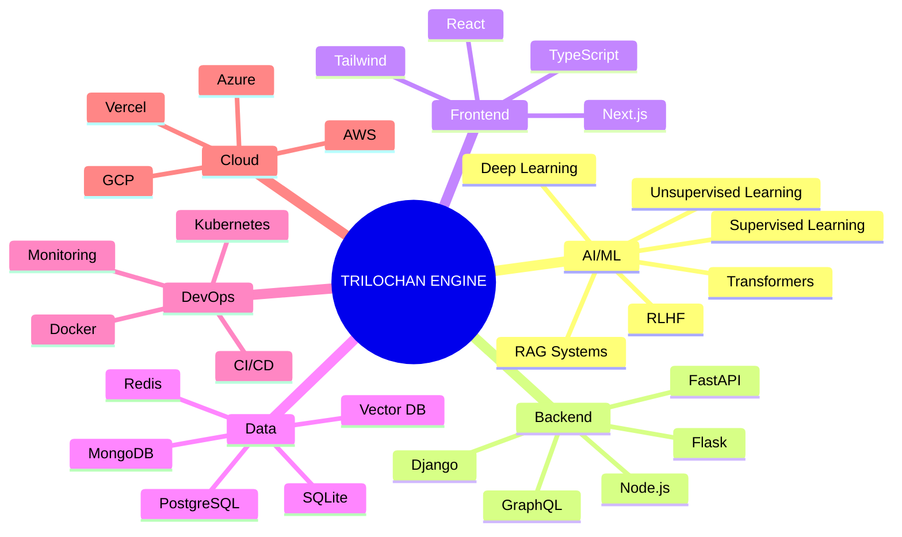

<div align="center">


</div>

<div align="center">

[](https://git.io/typing-svg)

</div>

<br/>

<div align="center">

[](https://www.linkedin.com/in/trilochan-sharma-995851370/)
[](https://twitter.com/parnish007)
[](mailto:parnishklpo@gmail.com)
[](https://github.com/parnish007)
[](https://parnish-aka-trilochan.vercel.app)

</div>

---

## 🧬 About Me

```python
class Trilochan:
    name        = "Parnish (Trilochan Sharma)"
    location    = "Nepal 🇳🇵"
    role        = "AI/ML & Full-Stack Engineer"
    focus       = ["Agentic AI", "RAG Systems", "LLM Fine-tuning", "MCP"]
    mission     = "Build impactful AI/ML solutions & contribute to cutting-edge research"
    fun_fact    = "I learn any tech needed to own the full pipeline — soup to nuts 🍜"

    def greet(self):
        return "Let's build something that actually matters 🚀"
```

<br/>

<table align="center">
<tr>
<td align="center">🚀 <b>Problem Solver</b><br/><sub>End-to-end across AI, ML, DL,<br/>NLP, Web, App & IoT</sub></td>
<td align="center">💡 <b>Documentation First</b><br/><sub>Every project, experiment &<br/>learning journey recorded</sub></td>
<td align="center">🌱 <b>Lifelong Learner</b><br/><sub>Always upskilling in AI/ML,<br/>math & modern engineering</sub></td>
<td align="center">⚡ <b>Passion</b><br/><sub>Emerging tech, complex problems,<br/>mastering new frameworks</sub></td>
</tr>
</table>

---

## 🧠 Tech Ecosystem



---

## 🛠️ Skills & Tech Stack

### 📐 Mathematics & Foundations
> Linear Algebra • Calculus • Probability & Statistics • Discrete Mathematics • Graph Theory • Optimization • Mathematical Modeling

---

### 💻 Programming Languages

<div align="center">


</div>

---

### 🤖 AI & Machine Learning

**Core Skills:** Supervised & Unsupervised Learning • Feature Engineering • Model Evaluation • Pipeline Design • Hyperparameter Tuning • Transfer Learning • Model Fine-tuning • DPO (Direct Preference Optimization)

<div align="center">


</div>

---

### 🧬 Deep Learning & NLP

**Deep Learning:** CNNs • RNNs • Transformers • GANs • LLM Applications • Transfer Learning • MobileNetV2 • Fine-tuning

**NLP:** Tokenization • Embeddings • Text Classification • Sentiment Analysis • Named Entity Recognition • Prompt Engineering

<div align="center">


</div>

---

### 🕸️ Agentic AI & RAG Systems

**Core Skills:** Multi-Agent Architecture • RAG Pipelines • Vector Search • LLM Orchestration • Prompt Engineering • Cosine Similarity • Embedding Pipelines • Response Caching • MCP (Model Context Protocol) • Tool Design • Policy Engines • Semantic Search • Circuit Breakers • Audit Logging • OpenAPI Auto-discovery • RLHF

<div align="center">


</div>

---

### 📊 Data Science & Analytics

**Skills:** Exploratory Data Analysis (EDA) • Statistical Analysis • Data Cleaning • Advanced Visualization • Feature Selection

<div align="center">


</div>

---

### 🌐 Web Development

**Frontend:** HTML • CSS • JavaScript • TypeScript • React • Next.js 14 (App Router) • shadcn/ui • Tailwind CSS

**Backend:** Node.js • Express.js • FastAPI • Django • Flask • REST APIs • GraphQL • SSE

**Security & Auth:** Swagger • OAuth2 • JWT • AES-256 Encryption • Supabase Auth • RLS

**Databases:** MongoDB • PostgreSQL • pgvector • MySQL • Redis • SQLite • Aerospike • Supabase

**ORM / Data Access:** Hibernate • JPA • Prisma • Drizzle

<div align="center">


</div>

<div align="center">


</div>

---

### ⚙️ Task Queues • Messaging • Streaming

<div align="center">


</div>

---

### ☁️ Cloud & Storage

**Platforms:** AWS (S3 • EC2 • Lambda) • Azure • GCP • Vercel &nbsp;|&nbsp; **Object Storage:** AWS S3 • Aerospike • Supabase Storage

<div align="center">


</div>

---

### 🔌 IoT & Edge

> Raspberry Pi • Arduino • ESP32 • Sensor Integration • Data Pipelines • Edge Computing • NVIDIA Edge AI • Wireless Protocol Design

---

### 🛡️ DevOps & Infrastructure

**Containerization:** Docker • Docker Compose • Kubernetes &nbsp;|&nbsp; **CI/CD:** GitHub Actions • Linux CLI • Bash &nbsp;|&nbsp; **Testing:** JUnit • Mockito • Zod Validation

<div align="center">


</div>

---

### 📡 Observability & Monitoring

<div align="center">


</div>

---

## 🚀 Featured Projects

### 🤖 Agentic AI & Automation

<table>
<tr>
<td width="50%" valign="top">

**🧑‍💼 [Job Agent](https://github.com/parnish007/jobagent)**

Fully autonomous end-to-end job application pipeline. Scrapes LinkedIn, Indeed & Glassdoor, scores listings via semantic search, generates ATS-optimized resumes using a DPO fine-tuned model, and autonomously submits applications. Includes a nightly RL feedback loop that retrains on real outcomes (rejection, view, interview).

`LangGraph` `FastAPI` `Next.js 14` `PostgreSQL` `pgvector` `Celery` `Redis` `Playwright` `HuggingFace TRL` `FastMCP`

</td>
<td width="50%" valign="top">

**🛠️ [cms-mcp](https://github.com/parnish007/cms-mcp) · [](https://www.npmjs.com/package/cms-mcp)**

Published MCP server giving Claude programmatic control over any REST-based CMS (Supabase, Strapi, Payload). Features 32 MCP tools, human approval gate (browser UI + SSE), policy engine with 10 rule types, semantic search, circuit breaker, audit logging & OpenAPI auto-discovery. 78 tests.

`TypeScript 5.8` `Node.js` `Zod` `SQLite` `Docker` `MCP SDK`

</td>
</tr>
<tr>
<td width="50%" valign="top">

**📚 [MeroStudySathy](https://github.com/parnish007/merostudysathy)**

Intelligent multi-agent PDF tutor. Upload any PDF → structured learning plan, interactive teaching sessions with citations, follow-up chat & evaluated practice questions. Full RAG pipeline with 4 specialized agents. Response caching cuts API costs by **60–80%**. Fully local — zero data leaves your machine.

`Next.js 14` `TypeScript` `SQLite Vector Store` `OpenAI / Gemini / Claude` `RAG` `LangChain` `AES-256`

</td>
<td width="50%" valign="top">

**🌐 [AI Portfolio Platform](https://parnish-aka-trilochan.vercel.app)**

Dynamic portfolio with RAG-based AI chatbot, admin CMS, analytics with CSV export & Supabase backend. Live on Vercel.

`Next.js 14` `Supabase` `TypeScript` `Gemini API` `Vercel`

<br/>

**🔗 [LFFTT](https://github.com/parnish007/lfftt)**

Full-stack web app with responsive design, state management & backend integration.

`React` `Node.js` `Express.js` `MongoDB`

</td>
</tr>
</table>

---

### 🧠 Deep Learning

<table>
<tr>
<td valign="top">

**🎬 [Scene Sorter](https://github.com/parnish007/scene-sorter)**

Production-grade scene classification & smart image organization system. MobileNetV2 transfer learning with FastAPI backend + Next.js frontend. Supports single & batch inference, auto folder sorting, ZIP export. Achieved **~86–87% accuracy** with optimized inference latency.

`TensorFlow` `Keras` `FastAPI` `Next.js` `Docker`

</td>
</tr>
</table>

---

### 📈 Classical Machine Learning

<table>
<tr>
<td width="50%" valign="top">

**🎯 [Intelligent Product Pitch Recommendation](https://github.com/parnish007/Intelligent-Product-Pitch-Recommendation-System)**

Advanced ML solution recommending optimal travel products. Single & bulk predictions, probability insights, CSV upload & interactive Streamlit UI.

`Scikit-learn` `Streamlit` `Pandas`

</td>
<td width="50%" valign="top">

**🎓 [Student Placement Prediction](https://github.com/parnish007/student_placement_project)**

Predicts placement based on IQ, CGPA, skills & internship experience. Full EDA, model building, evaluation & Streamlit deployment.

`Python` `Scikit-learn` `Streamlit`

</td>
</tr>
<tr>
<td width="50%" valign="top">

**📉 [Customer Churn Prediction](https://github.com/parnish007/customer-churn-prediction)**

End-to-end ML pipeline with preprocessing, feature engineering, modeling & Flask deployment.

`Python` `Scikit-learn` `Pandas` `Flask`

</td>
<td width="50%" valign="top">

**📊 [Data Analysis Project](https://github.com/parnish007/DA_project)**

Comprehensive EDA & visualization with statistical techniques and interactive charts.

`Python` `Pandas` `Matplotlib` `Seaborn`

</td>
</tr>
</table>

---

## 📊 GitHub Statistics

<div align="center">


</div>

<div align="center">


</div>

<div align="center">

[](https://github.com/parnish007)

</div>

---

## 🎯 Current Focus & Goals

| # | Area | What I'm doing |
|---|------|----------------|
| 🔬 | **Transformer Architectures** | Exploring advanced LLM internals and architecture variants |
| 🤖 | **Agentic AI Systems** | Building production-grade autonomous pipelines with real-world automation |
| 🧠 | **MCP Research** | Tool design, policy engines, cross-LLM memory & orchestration |
| 🔁 | **RL Feedback Loops** | Self-improving AI pipelines that learn from real outcomes |
| 📚 | **Open Source** | Contributing to AI/ML projects & publishing tools |
| 🌍 | **Real-World Impact** | Solving problems that actually matter |

---

## 💡 Philosophy

<div align="center">

> *"I believe in learning by doing. Every project is an opportunity to deepen understanding and create value.*
> *My mission is to build impactful AI/ML solutions and contribute to cutting-edge research and development."*

**⚡ Fun Fact:** I enjoy learning *any* technology needed to solve real-world problems end-to-end — from data engineering to deployment, I care about the **complete pipeline**.

</div>

---

## 🤝 Let's Collaborate!

<div align="center">

I'm always open to connecting on:

| 🤝 AI/ML Collaboration | 💬 LLM & MCP Discussions | 🎓 Knowledge Sharing | 🚀 Real-World Problem Solving |
|:---:|:---:|:---:|:---:|

**Reach out → [LinkedIn](https://www.linkedin.com/in/trilochan-sharma-995851370/) · [Twitter](https://twitter.com/parnish007) · [Email](mailto:parnishklpo@gmail.com)**

</div>

---

## ⭐ Support My Work

If you find my projects useful — **star a repo, share it, or drop feedback!** Every ⭐ keeps the momentum going.

---

<div align="center">


*Made with ❤️ by Parnish — Always learning, always building*

[](https://github.com/parnish007)

</div>
